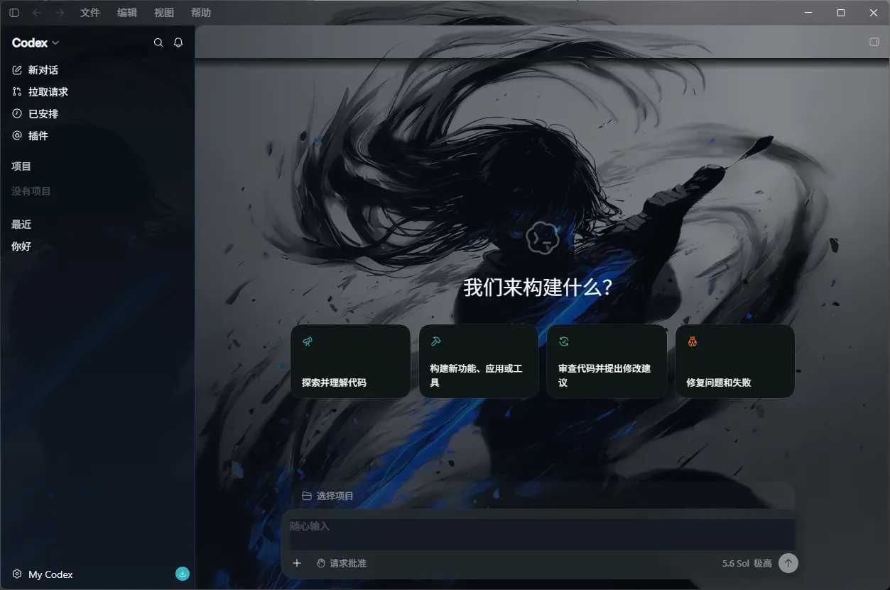
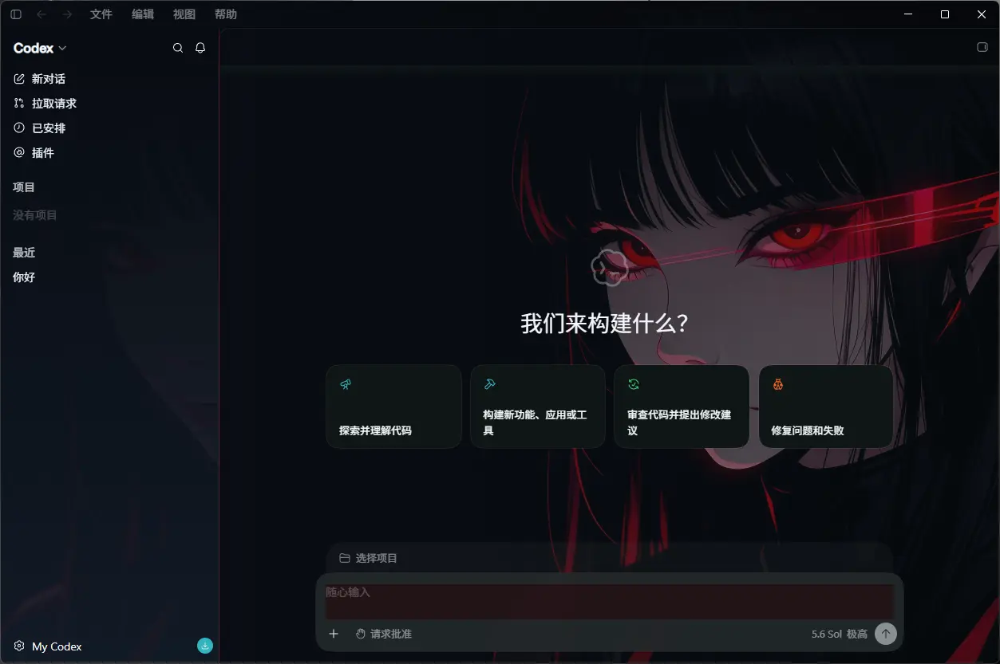
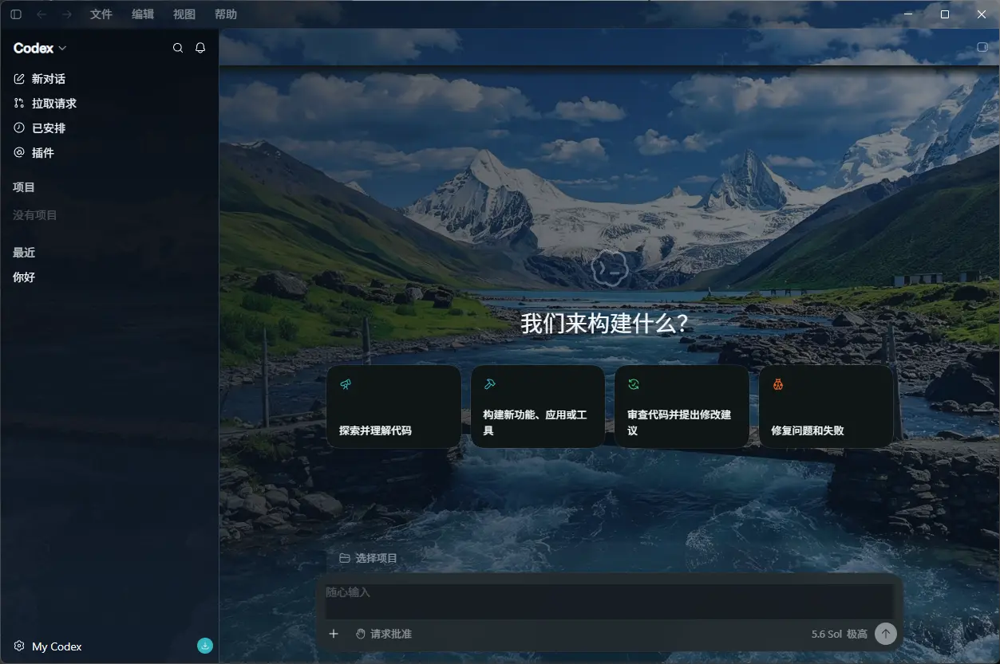
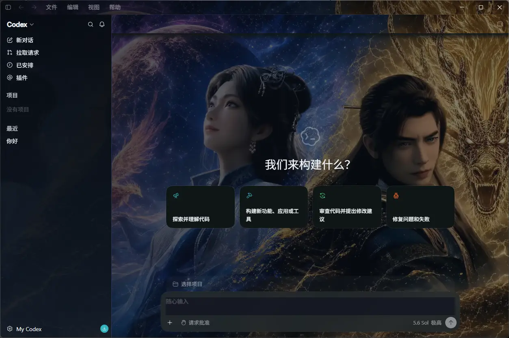
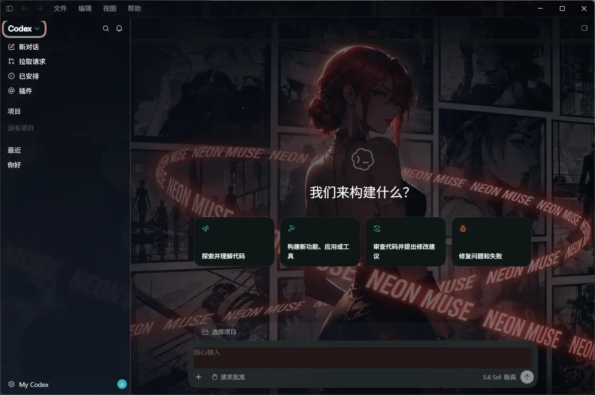
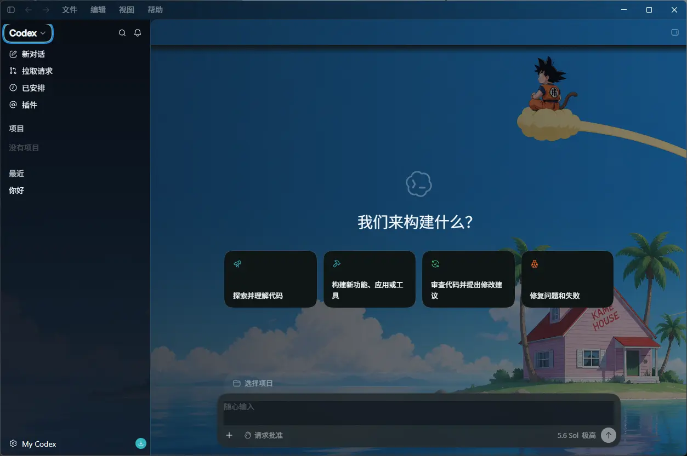

<h1 align="center">AWAI Codex Skins</h1>

<p align="center">
  面向 <a href="https://github.com/qq501987847/Codex-App-Manager">Codex App Manager</a> 的素材化 UI 主题目录。<br>
  提供可直接导入的 <code>.codexskin</code> 包、可编辑源文件、预览图和带 SHA-256 校验的在线目录。
</p>

<p align="center">
  <a href="https://github.com/qq501987847/codex-app-manager-skins/stargazers"></a>
  <a href="./index.json"></a>
  <a href="./LICENSE"></a>
</p>

<p align="center">
  <a href="#主题画廊">主题画廊</a> ·
  <a href="#使用皮肤">使用皮肤</a> ·
  <a href="#本地构建">本地构建</a> ·
  <a href="#贡献与发布">贡献与发布</a> ·
  <a href="#english">English</a>
</p>

---

## 这是什么

这是 AWAI 维护的 Codex 主题资源仓库，不是 Codex 本体，也不是独立运行的注入工具。主题由 Codex App Manager 负责展示、校验、试穿和应用；Manager 的运行时会把皮肤注入到正在运行的 Codex 界面，不修改 Codex 安装包。

当前目录包含 21 套壁纸主题。每套主题同时提供明暗外观配置，包内只负责视觉样式，品牌、管理器主题色和 API 地址仍由 Manager 管理。

## 主题画廊

> 画廊目前只展示已完成 Codex 真机截图的 10 套主题。

<table>
  <tr>
    <td align="center" width="50%"><a href="./packs/awai-01-1.0.0.codexskin"><br><b>Ink Wanderer</b></a><br><code>awai-01</code></td>
    <td align="center" width="50%"><a href="./packs/awai-03-1.0.0.codexskin"><br><b>Skybound Motion</b></a><br><code>awai-03</code></td>
  </tr>
  <tr>
    <td align="center"><a href="./packs/awai-05-1.0.0.codexskin"><br><b>Blue Stroke</b></a><br><code>awai-05</code></td>
    <td align="center"><a href="./packs/awai-06-1.0.0.codexskin"><br><b>Lakeside Evening</b></a><br><code>awai-06</code></td>
  </tr>
  <tr>
    <td align="center"><a href="./packs/awai-12-1.0.0.codexskin"><br><b>Red Signal</b></a><br><code>awai-12</code></td>
    <td align="center"><a href="./packs/awai-13-1.0.0.codexskin"><br><b>Blue Guardians</b></a><br><code>awai-13</code></td>
  </tr>
  <tr>
    <td align="center"><a href="./packs/awai-14-1.0.0.codexskin"><br><b>Mountain River</b></a><br><code>awai-14</code></td>
    <td align="center"><a href="./packs/awai-16-1.0.0.codexskin"><br><b>Cosmic Pair</b></a><br><code>awai-16</code></td>
  </tr>
  <tr>
    <td align="center"><a href="./packs/awai-18-1.0.0.codexskin"><br><b>Red Frequency</b></a><br><code>awai-18</code></td>
    <td align="center"><a href="./packs/awai-20-1.0.0.codexskin"><br><b>Skyline Story</b></a><br><code>awai-20</code></td>
  </tr>
</table>

## 使用皮肤

### 方式 A：Codex App Manager（推荐）

1. 安装并打开 [Codex App Manager](https://github.com/qq501987847/Codex-App-Manager)。
2. 进入主题页，刷新在线目录，选择喜欢的主题。
3. 直接安装或试穿；也可以把本仓库 `packs/` 里的 `.codexskin` 文件拖入主题页导入。

Manager 会在下载目录包后按 `index.json` 中的 `bytes` 和 `sha256` 做完整性校验。主题应用失败时，可以在 Manager 中还原到原生外观。

### 方式 B：手动导入

打开 [packs/](./packs)，下载任意 `awai-<序号>-1.0.0.codexskin`，然后在 Manager 的主题页选择导入。单独下载主题包时，建议同时参考 [index.json](./index.json) 中的版本、大小和 SHA-256 信息。

## 仓库结构

| 路径 | 用途 |
| --- | --- |
| `themes/<id>/` | 主题源文件：`theme.json`、`theme.css`、背景资源和包内预览图 |
| `packs/<id>-<version>.codexskin` | 可由 Manager 导入的发布包 |
| `previews/<id>.webp` | README 和在线目录使用的封面图 |
| `index.json` | 在线目录清单；只使用相对路径，并记录包的 SHA-256 |
| `scripts/build-catalog.mjs` | 从 Manager 生成的候选目录重建主题、发布包和索引 |

## 本地构建

要求：Node.js 20+，以及相邻的 `Codex-App-Manager` 仓库。

```bash
cd ../Codex-App-Manager
node scripts/build-dream-skins-from-wallpapers.mjs

cd ../Codex-App-Manager-Skins
node scripts/build-catalog.mjs
```

也可以显式指定候选目录：

```bash
node scripts/build-catalog.mjs --input ../Codex-App-Manager/dist/dream-skins-YYYYMMDD
```

脚本会重建并覆盖 `themes/`、`packs/`、`previews/` 和 `index.json`。因此真机截图应在最后一次构建完成后替换；若要重新构建，先把截图保存在仓库外，避免被生成流程覆盖。

当前包的 `codexVerified` 保持为空，表示尚未把具体 Codex 版本写入兼容性声明。真机验证完成后，再更新相应字段和预览图，不要把素材占位图当作验证结果。

## 贡献与发布

提交主题时请优先修改 `themes/<id>/` 源目录，再运行构建脚本生成 `packs/`、`previews/` 和 `index.json`。不要只提交一个无法追溯来源的压缩包。

发布前请确认：

- 主题 ID 稳定且只包含小写字母、数字和连字符；
- `theme.json`、`theme.css`、背景资源和预览图都能被 Manager 读取；
- 包和目录中的路径均为相对路径，SHA-256 与最终包字节一致；
- 预览图来自实际运行中的 Codex（当前仓库仍在补齐这一步）；
- 壁纸、人物、商标和第三方素材具备相应的再分发权利。

同步位置： [GitHub 主源](https://github.com/qq501987847/codex-app-manager-skins) · [Gitee 备用源](https://gitee.com/qq501987849/codex-app-manager-skins)。两边应保持相同的内容和分支结构。

## 许可与边界

仓库脚本和文档使用 [MIT License](./LICENSE)。主题中的壁纸资源按各主题元数据标记为 `personal-use`，不等同于 MIT，也不自动授予商业使用或第三方素材再分发权。

本项目是社区维护的非官方主题资源，与 OpenAI、Codex 或 Microsoft 无隶属、授权或背书关系。使用包含第三方 IP 的素材前，请自行确认授权范围。

---

<a id="english"></a>

## English

AWAI Codex Skins is a theme catalog for [Codex App Manager](https://github.com/qq501987847/Codex-App-Manager). It ships editable theme sources, importable `.codexskin` packages, preview assets, and a relative-path catalog with SHA-256 metadata.

The repository currently contains 21 wallpaper-based themes. Each theme includes dark and light appearance settings. Manager owns the runtime application, branding, accent color, and API configuration; this repository only ships visual theme assets.

### Use a skin

Open the Manager theme page and refresh the catalog, or download a package from [`packs/`](./packs) and import the `.codexskin` file. The catalog records package size and SHA-256 so the Manager can verify downloads before installation.

### Build

Requires Node.js 20+ and the sibling `Codex-App-Manager` repository:

```bash
cd ../Codex-App-Manager
node scripts/build-dream-skins-from-wallpapers.mjs
cd ../Codex-App-Manager-Skins
node scripts/build-catalog.mjs
```

The build regenerates `themes/`, `packs/`, `previews/`, and `index.json`. Ten previews are now real Codex screenshots; replace the remaining placeholders only after the final build because generated preview files are overwritten by a subsequent build.

### License

Repository scripts and documentation are MIT-licensed. Theme wallpaper assets are marked `personal-use` in their metadata and may have separate redistribution requirements. This is an unofficial community project and is not affiliated with OpenAI, Codex, or Microsoft.
